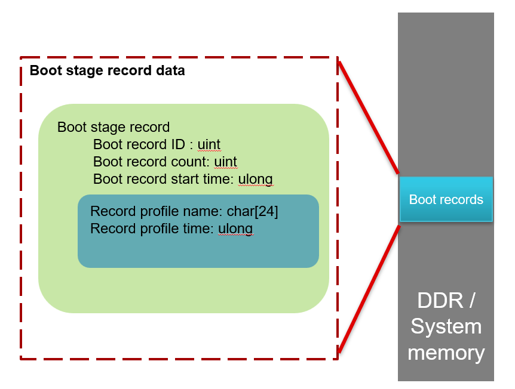

# Boot Stage Record Library

## Overview

The Boot Stage Record library provides a standardized way to measure and track boot time performance across different components of an embedded system. Inspired by U-Boot's bootstage record, this lightweight profiling tool allows developers to instrument their boot process with consistent timing measurements, helping identify bottlenecks and track performance improvements.



## Features

- Standardized data structure across all system components
- Memory efficient with no dynamic allocation
- Platform-independent timestamp mechanism
- Single boot stage with multiple measurement points
- Simple API with minimal function calls

## Data Structures

### `boot_record_profile_t`

This structure stores information about a single profile measurement:

```c
typedef struct
{
    /* Name of the record profile */
    char name[24];
    /* Time measurement for this profile */
    uint64_t time;
} boot_record_profile_t;
```

- `name[24]`: A null-terminated string identifier for the profile point
- `time`: A timestamp value in microseconds, captured at the profile point

### `boot_stage_record_t`

This structure represents a boot stage with its associated profile records:

```c
typedef struct
{
    /* Unique identifier for this record */
    uint32_t record_id;
    /* Count of profile records in this boot stage */
    uint32_t record_count;
    /* Start time of this boot stage */
    uint64_t start_time;
    /* Array of profile records */
    boot_record_profile_t profiles[0];
} boot_stage_record_t;
```

- `record_id`: A unique identifier for this boot stage
- `record_count`: Number of profile records currently stored
- `start_time`: Timestamp when this boot stage began
- `profiles[0]`: Flexible array member storing variable number of profile records

### `boot_records_t`

This internal structure manages the overall boot record configuration:

```c
typedef struct
{
    /* Base address of allocated memory */
    void *memory_base;
    /* Size of allocated memory */
    uint32_t memory_size;
    /* Number of possible record count */
    uint32_t possible_records;
    /* Array of boot stage records */
    boot_stage_record_t *records;
} boot_records_t;
```

- `memory_base`: Base address of the allocated memory block
- `memory_size`: Total size of the allocated memory block
- `possible_records`: Maximum number of profile records that can be stored
- `records`: Pointer to the boot stage record structure

## API Functions

### `boot_record_init`

Initializes the boot record library with a specified memory area.

```c
boot_record_status_t boot_record_init(uint32_t stage_id, void *memory_addr, uint32_t size);
```

Parameters:
- `stage_id`: Unique identifier for this boot stage
- `memory_addr`: Pointer to pre-allocated memory for storing records
- `size`: Size of the allocated memory in bytes

Returns:
- `BOOT_RECORD_SUCCESS`: Initialization successful
- `BOOT_RECORD_ERR_INVALID_PARAMS`: Invalid parameters
- `BOOT_RECORD_ERR_INSUFFICIENT_MEM`: Not enough memory

### `boot_record_log_profile`

Records a profile point with the current timestamp.

```c
boot_record_status_t boot_record_log_profile(const char *name);
```

Parameters:
- `name`: Name of the profile point to record

Returns:
- `BOOT_RECORD_SUCCESS`: Profile recorded successfully
- `BOOT_RECORD_ERR_INVALID_PARAMS`: Invalid parameters
- `BOOT_RECORD_ERR_OVERFLOW`: Profile record limit exceeded

### `boot_record_get_timestamp`

A weak function that should be implemented by the user to provide platform-specific timestamp functionality.

```c
__attribute__((weak)) uint64_t boot_record_get_timestamp(void);
```

Returns:
- Current timestamp in microseconds

## Integration Guide

### Adding to Your Build System

#### 1. For Make-based builds

Add the following to your Makefile:

```make
# Include Boot Record Library
BOOT_RECORD_DIR := path/to/drivers/boot-stage-record
INCLUDES += -I$(BOOT_RECORD_DIR)
SRCS += $(BOOT_RECORD_DIR)/bootrecord.c
```

#### 2. For CMake-based builds

```cmake
# Add Boot Record Library
add_subdirectory(path/to/drivers/boot-stage-record)
target_link_libraries(your_target bootrecord)
```

### Component Integration

#### 1. Implement Platform-Specific Timestamp Function

```c
/* Define in your platform code */
uint64_t boot_record_get_timestamp(void)
{
    /* Example for ARM Cortex-M based platforms */
    uint32_t cycles = DWT->CYCCNT;
    uint32_t freq = SystemCoreClock;

    /* Convert cycles to microseconds */
    return ((uint64_t)cycles * 1000000ULL) / freq;
}
```

#### 2. Allocate Boot Record Memory

For bootloader integration:

```c
/* In your bootloader's early initialization */
#define BOOT_RECORD_SIZE 4096  /* Adjust based on your needs */
static uint8_t boot_record_memory[BOOT_RECORD_SIZE] __attribute__((aligned(8), section(".boot_record")));

void early_init(void)
{
    /* Initialize with stage ID 1 for bootloader */
    boot_record_init(1, boot_record_memory, BOOT_RECORD_SIZE);
    boot_record_log_profile("Bootloader_Start");

    /* Continue bootloader initialization */
}
```

For component-level integration:

```c
/* In your component initialization */
void component_init(void)
{
    /* Access pre-allocated memory region for boot records */
    extern uint8_t __boot_record_section_start[];
    extern uint8_t __boot_record_section_size[];

    /* Initialize with unique component ID */
    uint32_t component_id = 0x100;  /* Choose a unique ID scheme */
    boot_record_init(component_id, __boot_record_section_start,
                   (uint32_t)__boot_record_section_size);

    boot_record_log_profile("Component_Init_Start");

    /* Component initialization logic */

    boot_record_log_profile("Component_Init_Complete");
}
```

#### 3. Linker Script Configuration

Add to your linker script:

```
SECTIONS {
    /* Other sections... */

    .boot_record (NOLOAD) : {
        __boot_record_section_start = .;
        . = ALIGN(8);
        KEEP(*(.boot_record))
        . = ALIGN(8);
        __boot_record_section_end = .;
    } > RAM

    __boot_record_section_size = __boot_record_section_end - __boot_record_section_start;

}
```

## Memory Layout

The library uses a contiguous block of memory organized as follows:

1. `boot_stage_record_t` structure at the beginning of the memory block
2. Followed by an array of `boot_record_profile_t` structures (size determined at initialization)

## Usage Example

```c
#include "bootrecord.h"

/* Example for tracking bootloader initialization */
void bootloader_main(void)
{
    /* Allocate memory for boot records */
    static uint8_t boot_memory[1024] __attribute__((aligned(8)));

    /* Initialize boot record system with stage ID 1 */
    boot_record_init(1, boot_memory, sizeof(boot_memory));

    /* Record first profile point */
    boot_record_log_profile("Bootloader_Start");

    /* Hardware initialization */
    init_clocks();
    boot_record_log_profile("Clocks_Initialized");

    init_memory_controller();
    boot_record_log_profile("Memory_Controller_Ready");

    load_os_image();
    boot_record_log_profile("OS_Image_Loaded");

    /* Boot complete */
    boot_record_log_profile("Bootloader_Complete");

    /* Boot record data remains in memory for OS to analyze */
    jump_to_os();
}
```
## Performance Considerations

- The library uses minimal CPU resources during recording
- Memory usage is predictable and defined at initialization
- No dynamic memory allocation occurs during operation
- Profile names are limited to 23 characters plus null terminator

## License

Copyright (C) 2025 Texas Instruments Incorporated

This library is provided under the terms of the BSD 3-Clause license.